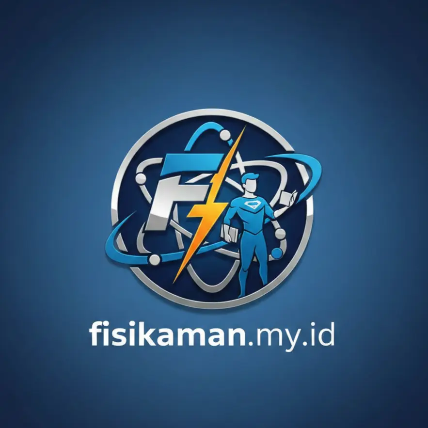

<div align="center">

  

  <br/>
  <a href="https://fisikaman.my.id">
    
  </a>

  <p align="center">
    <b>Platform Belajar Fisika Modern dengan Antarmuka Liquid Glass</b>
    <br />
    <a href="https://fisikaman.my.id"><strong>Lihat Demo »</strong></a>
  </p>
</div>

<div align="center">
  
  
  
  
</div>

<br />

## 🚀 Tentang Proyek

**Fisikaman** adalah portal web edukasi fisika berbasis web yang dirancang untuk membuat belajar fisika menjadi pengalaman yang visual dan interaktif. Fisikaman menggunakan pendekatan desain **Liquid Glass Morphism** yang futuristik.

### ✨ Fitur Utama
- **Liquid Glass UI:** Desain antarmuka transparan dengan animasi *blob* latar belakang yang hidup dan *smooth*.
- **Laboratorium Interaktif:** Tools penghitung rumus fisika secara *real-time*.
- **Kuis Dinamis:** Sistem kuis interaktif untuk menguji pemahaman materi.
- **Responsif Total:** Tampilan otomatis menyesuaikan layar tanpa *lag*.
- **Konfigurasi JSON:** Mengubah logo, judul, dan pengaturan melalui file `settings.json`.

---

## 📂 Struktur Folder

```bash
design-web-fisika/
├── 📄 index.html      # Kerangka utama website
├── 🎨 style.css       # Desain Liquid Glass & Animasi
├── 🧠 script.js       # Logika kalkulator, kuis, & config loader
├── 🎬 animasi.js      # Engine animasi scroll & background
├── ⚙️ settings.json   # Pengaturan situs
└── 🖼️ logo.webp       # Aset Logo utama
```
